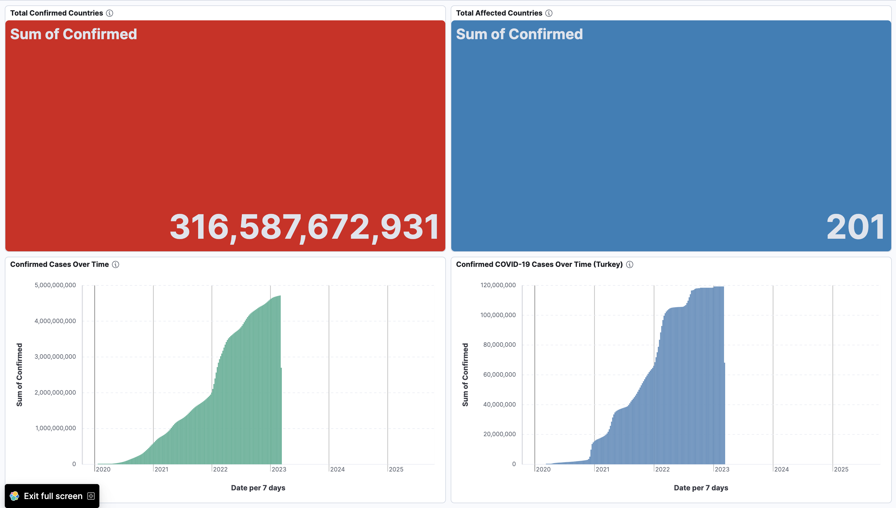
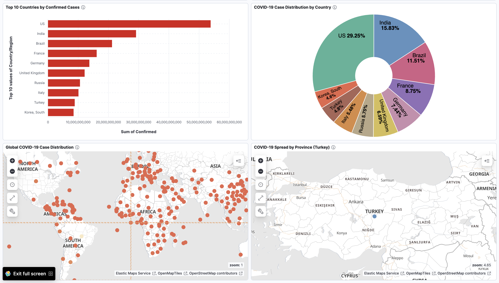

# COVID-19 Dashboard

## Description

COVID-19 Dashboard is a data ingestion and analytics stack built with Python on the pipeline and Elasticsearch as the datastore, with Kibana for visualization and exploration.

The application provides an end-to-end workflow that covers data acquisition, transformation, and indexing. It downloads the Johns Hopkins CSSE global time-series dataset, normalizes it into a tidy format, and indexes documents containing Province/State, Country/Region, Date, Confirmed, and a geo_point location.

In addition, the project defines an Elasticsearch index mapping with proper field types and includes a bulk loader that handles chunked ingestion, automatic index refresh, and ingestion verification. A Docker Compose setup provisions a single-node Elasticsearch and Kibana stack for local development.

With its simple CLI utilities and Dockerized setup, COVID-19 Dashboard enables reproducible time-series and geospatial analysis workflows ready to be explored in Kibana.

## Features

- **Data Acquisition**: Downloads the latest CSSE COVID-19 time-series CSV via a configurable URL
- **Data Processing**: Pandas-based melt, date parsing, null filtering, and tidy normalization
- **Geospatial Enrichment**: Builds Elasticsearch-compatible geo_point from latitude/longitude
- **Index Mapping**: Creates index with keyword, date, integer, and geo_point field types
- **Bulk Ingestion**: Chunked uploads with timeouts using Elasticsearch helpers.bulk
- **Verification**: Post-ingestion refresh and count validation against prepared records
- **Docker Compose**: Single-node Elasticsearch and Kibana for local analytics
- **Configuration**: Centralized settings for hosts, index name, data paths, and source URL
- **Idempotent Loads**: Safe re-runs by deleting and recreating the target index when present
- **Operational Logging**: Console output for cluster info, progress, warnings, and errors

## Screenshots

<table>
  <tr>
    <td align="center">
      <a href="screenshots/graphs1.png">
        
      </a><br/><sub></sub>
    </td>
    <td align="center">
      <a href="screenshots/graphs2.png">
        
      </a><br/><sub></sub>
    </td>
  </tr>
</table>

## Installation

1. **Clone the repository**
   ```bash
   git clone https://github.com/omeroztprk/covid19-dashboard.git
   cd covid19-dashboard
   ```

2. **Create and activate a virtual environment (macOS)**
   ```bash
   python3 -m venv .venv
   source .venv/bin/activate
   ```

3. **Install Python dependencies**
   ```bash
   pip install --upgrade pip
   pip install -r requirements.txt
   ```

4. **Start Elasticsearch and Kibana with Docker**
   ```bash
   docker compose up -d
   ```
   Verify Elasticsearch is reachable:
   ```bash
   curl http://localhost:9200
   ```

5. **Configure project settings (optional)**
   Edit config.py if you need to change defaults:
   ```python
   ELASTIC_HOST = "http://localhost:9200"
   CSV_URL = "https://raw.githubusercontent.com/CSSEGISandData/COVID-19/master/csse_covid_19_data/csse_covid_19_time_series/time_series_covid19_confirmed_global.csv"
   INDEX_NAME = "covid19_cases"
   CSV_FILE_NAME = "time_series_covid19_confirmed_global.csv"
   DATA_DIR = "data"
   ```

6. **Download the dataset**
   ```bash
   python3 data_fetcher.py
   ```

7. **Load data into Elasticsearch**
   ```bash
   python3 elasticsearch_loader.py
   ```

## Running the Application

**Start Elasticsearch and Kibana:**
```bash
docker compose up -d
```

Open Kibana at http://localhost:5601 and create visualizations using the covid19_cases index.

## License

This project is licensed under the MIT License - see the [LICENSE](LICENSE) file for details.
